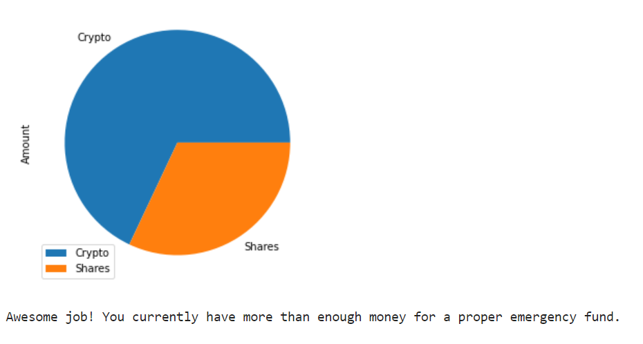
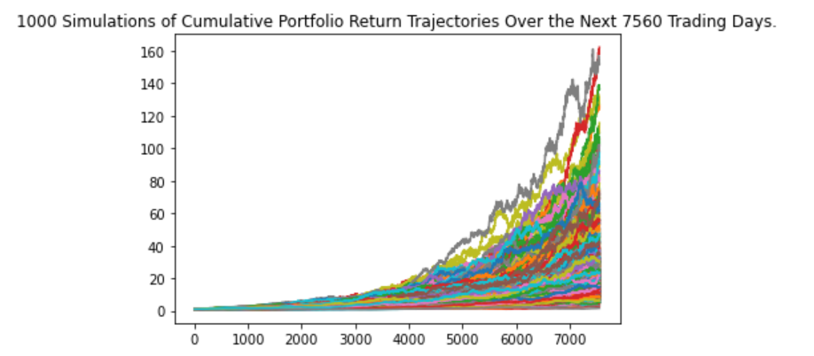
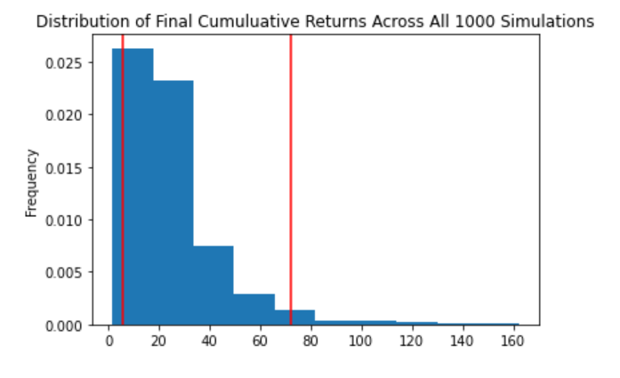

# Personal Finance Planner

This repository contains scripts to perform two analyses of personal finances using Python and APIs (Alternative Free Crypto API and Alpaca API):

1.  Based on a person's set monthly income and shares of stocks and cryptocurrency, their account balance was calculated in order to determine if the balance is sufficient to meet the requirements of their emergency fund. A pie chart of the breakdown of the portfolio and a message of whether the person has saved enough for their emergency fund are both printed to the screen in Python, as shown in the screenshot below.

    

2. Using 5 years worth of historical data for two exchange traded funds (ETFs), SPY and AGG, Monte Carlo simulations were performed to predict the cumulative portfolio returns over 30 years for retirement. The initial calculations were performed using a 60% stocks (SPY) and 40% bonds (AGG) breakdown with 1,000 simulations run. The graphed simulations and the probability distribution with confidence intervals that are displayed in Python are shown below. With the simulations completed, varying initial investments ($20,000 and $30,000) were used to determine the portfolio balance at the end of the 30 years (with 95% confidence). Finally, early retirement options of 5 and 10 year timeframes using a 90% stocks / 10% bonds portfolio breakdown were examined with initial investments of $200,000 and $100,000, respectively. These initial investments are significantly more than the 30 year simulations, but they're required with the shorter timeframes. 

    
    

Both the emergency fund and retirement planning analyses are unique to each person, depending on their lifestyles, preferences, and situations. The total amount of money required for retirement or an emergency fund amount may be sufficient for one person but not for another. Each person's situation and circumstances should be analyzed individually and checked periodically to make sure the analysis and assumptions still hold true.